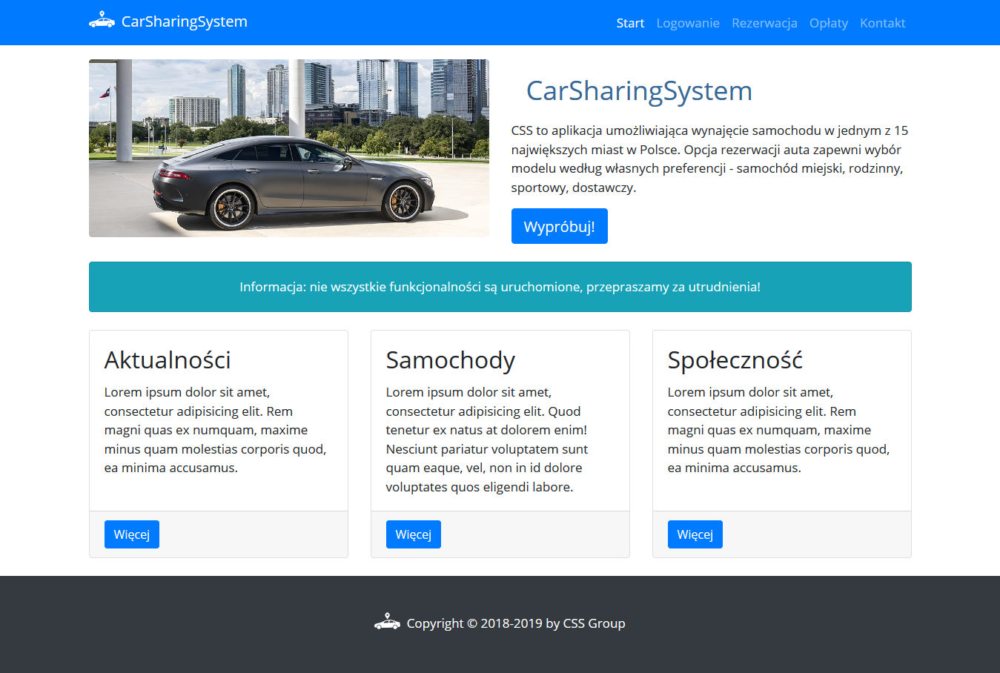

# CSS - CarSharingSystem 

[PL description]  
CSS to aplikacja umożliwiająca wynajęcie samochodu w największych miastach w Polsce.
Opcja rezerwacji auta zapewni wybór modelu według własnych potrzeb - samochód miejski, rodzinny, sportowy, terenowy, dostawczy.
## Główne funkcje aplikacji
* rejestracja użytkownika,
* zmiana danych użytkownika,
* opcja potwierdzenia rezerwacji,
* opcja anulowania rezerwacji,
* opcja kalkulacji kosztów wypożyczenia.

### Strona główna - wygląd

